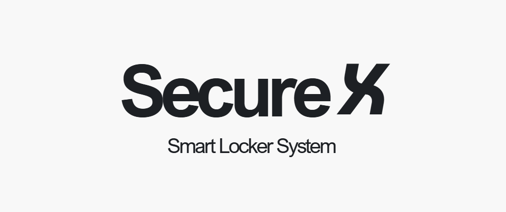

___
# Secure X Smart Locker System
<!--  -->

---
Team members
-  E/20/036, K.G.R.I. Bandara, [email](mailto:e20036@eng.pdn.ac.lk)
-  E/20/212, R.M.S.H. Kumarasinghe , [email](mailto:e20212@eng.pdn.ac.lk)
-  E/20/350, J.P.D.N. Sandamali, [email](mailto:e20350@eng.pdn.ac.lk)
-  E/20/377, V.P.H. Sidantha, [email](mailto:e20377@eng.pdn.ac.lk)
---
___

___

# Description

The SmartSecure Locker System is a versatile and scalable IoT-based solution designed to provide secure and efficient storage in a variety of shared environments such as universities, gyms, offices and libraries. The system connects multiple locker locations, allowing users to check real-time availability via a mobile or web application. If lockers at a preferred location are fully occupied, the system intelligently suggests the nearest alternative location, offering a seamless and flexible user experience.

Access is secured through a figerprint sensor, ensuring safety and convenience. Users can reserve lockers, receive notifications, and navigate to alternative locations with ease. Administrators can manage locker usage and monitor the system through a centralized dashboard. This solution reduces theft risks, optimizes locker utilization, and provides a modern, adaptable storage system suitable for various community-driven environments.

